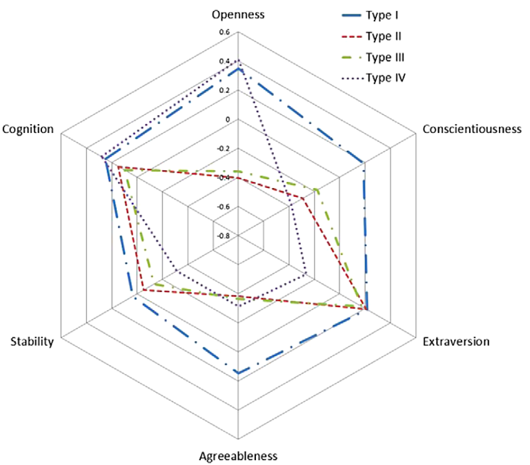
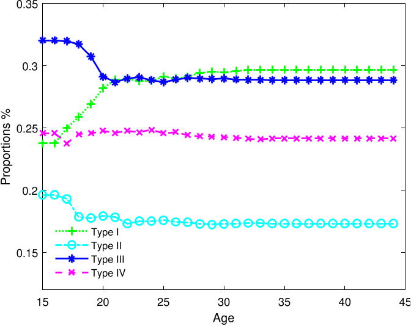

# A dynamic model of personality, schooling, and occupational choice

## Petra E. Todd and Weilong Zhang

---
# Overview

- Choice: schooling vs working $d(a)$
- State:
  - Experience: years of schooling $g(a)$, working $x_1(a),x_2(a)$
  - Personality traits $\Theta(a)$
  - Cognitive ability $c$
- Latent type: $k(a)$

---

---

# Motivation

- How personality traits affect choice and the other way around?
> Allowing personality traits to evolve with age and with years of schooling proves to be important in capturing heterogeneity in how people respond to educational policies.

---

# Question 
- How does personality traits $\Theta(a)$ evolve?
  - with age $a$
  - with years of schooling $g(a)$
- How does type $k(a)$ evolve?
  - with age $a$
  - with personality traits $\Theta(a)$

<!-- *Remark*: They specify the law of motion in such a way. -->
<!-- - Personality trait $\Theta(a)$
- Latent type $k(a)$ -->

---
# Law of motion of state and type

- schooling: $g(a+1) = g(a) + d_3(a)$
- working: $x_1(a+1) = x_1(a) + d_1(a)$, $x_2(a+1) = x_2(a) + d_2(a)$

- personality: $\theta(a+1)=f(\theta(15),g(a),a)$ and shock $\zeta(a)$.
  
- type: $k(a)$ transition via $L(a)=(1-p(a))\boldsymbol{I}+p(a)\boldsymbol{Q}(a,\theta(a))$ and shock $\eta(a)$.

---
# Utility

- from schooling: $u_3(a)=h_3(k(a),a)+\epsilon_3(a)$
- from working: $u_1(a)= h_1(k(a),a,g(a),x_1(a),x_2(a)) + \epsilon_1(a)$

---
# Identification

Recall the Hu and Shum (2012) identification assumption: 

1. Conditional on current $(d(a),s(a),k(a))$, the future $(d(a+1),s(a+1),k(a+1))$ is independent of the past $(d(a-1),s(a+1),k(a-1))$.
2. Current choice and state $(d(a),s(a))$ only depends on last choice and state $(d(a-1),s(a-1))$ and current type $k(a)$:  $(d(a),s(a))\perp k(a-1)|d(a-1),s(a-1),k(a)$

---
# Identification

The paper cites another paper (Hu et al., 2015) which imposes a more restrictive assumption on the **limited feedback condition** so that only three contiguous periods are required.
1. Current choice $d(a)$ only depends on current state $s(a)$ and type $k(a)$: $\Pr(d(a)|s(a),k(a),d(a-1),s(a-1),k(a-1))=\Pr(d(a)|s(a),k(a))$
2. Current type only depends on last type, current state and last state: $\Pr(k(a)|s(a),s(a-1),k(a-1),d(a-1))=\Pr(k(a)|s(a),s(a-1),k(a-1))$

---

---

---
# Estimation: Simulated method of moments

1. Given a set of parameters $\theta^0$, simulate the model.
   1. Solve backward for the value function and choice probabilities.
   2. Simulate shocks. Get choice.
   3. Based on the realized choice, calculate the moments.
2. Compute the difference bewteen the moments from the simulated data and the empirical data. Update $\theta^1$. Repeat until optimal.

*Remark*:
$$ \min_\theta S_\theta = \left\{\frac{1}{n}\sum_{i=1}^n \left[f(X_i) - \frac{1}{m} \sum_{j=1}^m G(Z_j; \theta)\right]\right\}^\top \Omega \left\{\frac{1}{n}\sum_{i=1}^n \left[f(X_i) - \frac{1}{m} \sum_{j=1}^m G(Z_j; \theta)\right]\right\}$$

<!-- *Remark*:  Whether or not the model is "well identified" using a particular vector of sample moments is often determined after estimation has been attempted. Different sets of moments can yield different point estimates and associated standard errors in small samples, but it is seldom possible to determine an "optimal" vector of moments in a reasonably complex estimation problem. A specific parameter is said to be precisely estimated if the ratio of its point estimate to its estimated standard error is large in absolute value. In our case, it is almost never the case that this ratio of the parameter to its standard error is close to zero. -->
---
# Results
1. "Fixed type" is rejected statistically. (malleable when young --> fixed around 30)
>The simulated policy responses are greater and the effects more evenly distributed across individuals in our sample in a varying type model than in a fixed-type model.
2. Cognitive ability (time-invariant) and non cognitive ability (time-varying) go hand in hand.
> Because cognitive and noncognitive attributes tend to be positively correlated, studies that only focus on cognitive traits likely overstate their importance as a determinant of labor market success.

---
# Results

 

---

# :snake: Thanks :snake:

